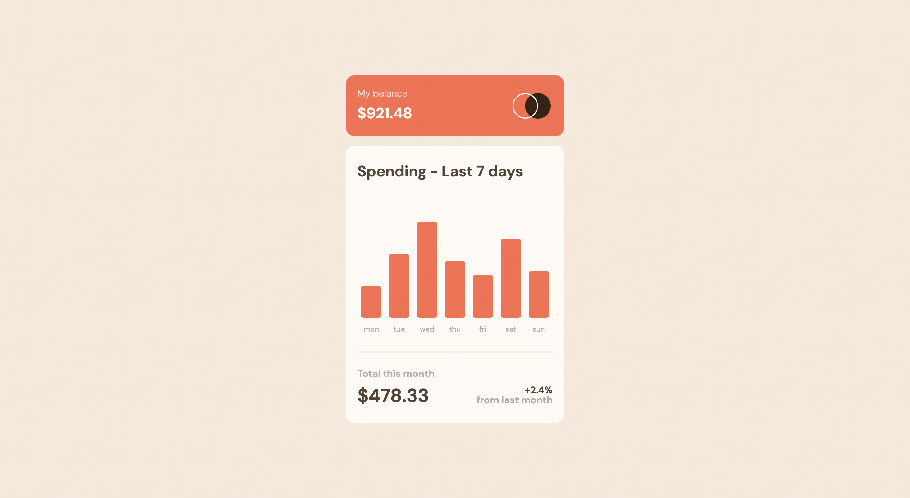
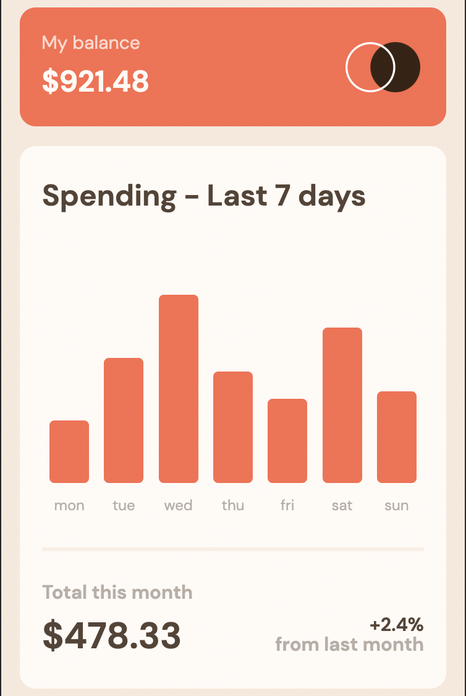

# Frontend Mentor - Expenses chart component solution

This is a solution to the [Expenses chart component challenge on Frontend Mentor](https://www.frontendmentor.io/challenges/expenses-chart-component-e7yJBUdjwt). Frontend Mentor challenges help you improve your coding skills by building realistic projects. 

## Table of contents

- [Overview](#overview)
  - [The challenge](#the-challenge)
  - [Screenshot](#screenshot)
  - [Links](#links)
- [My process](#my-process)
  - [Built with](#built-with)
  - [What I learned](#what-i-learned)
  - [Continued development](#continued-development)
  - [Useful resources](#useful-resources)
- [Author](#author)
- [Acknowledgments](#acknowledgments)

## Overview

### The challenge

Users should be able to:

- View the bar chart and hover over the individual bars to see the correct amounts for each day
- See the current day’s bar highlighted in a different colour to the other bars
- View the optimal layout for the content depending on their device’s screen size
- See hover states for all interactive elements on the page
- **Bonus**: Use the JSON data file provided to dynamically size the bars on the chart

### Screenshot

## Desktop

## Mobile

### Links

- Solution URL: [Solution URL here](https://github.com/Reykjabik/expenses-chart)
- Live Site URL: [Live site URL here](https://reykjabik.github.io/expenses-chart/)

## My process

### Built with

- Semantic HTML5 markup
- SCSS custom properties
- Flexbox
- CSS Grid
- Mobile-first workflow
- Vanilla JS

### What I learned

I really had to brush up on my Grid skills, as it had been a long while since I last used it. It is my first junior project here in FrontendMentor, so I had to finally put what I know of JS in use. I have studied JS many times in the past, but I have always found using it a much steeper learning curve than HTML or CSS. I understand most of the workings of the language, but getting to use it has been a bit trickier. Anyway, the first step is done.

### Continued development

I found loading JSON a much more complex task than I thought. I initially thought that a simple Google search would give me a sort of copy&paste answer, but I found so many ways of doing it, involving more advanced areas of JS that I still don't know about (promises, requests, etc) that I actually struggled doing this. Definitely honing my JS skills is my main aim here.

I though that I more or less am comfortable using flex and grid, but it seems I find centering certain items is still a pain. The prices that pop in when hovering are not exactly centered to their columns, and I couldn't find a way of doing so. I might need just one line in my CSS, I just couldn't figure out which one. 

I find my CSS a but messy, and although I try to minimize it and delete redundancies at the end of each project, I still think there is a lot of room for improvement.

### Useful resources

- [CSS Tricks](https://css-tricks.com/snippets/css/complete-guide-grid/) - I cannot really say the number of times I resorted to this website.

## Author

- Frontend Mentor - [@reykjabik](https://www.frontendmentor.io/profile/reykjabik)